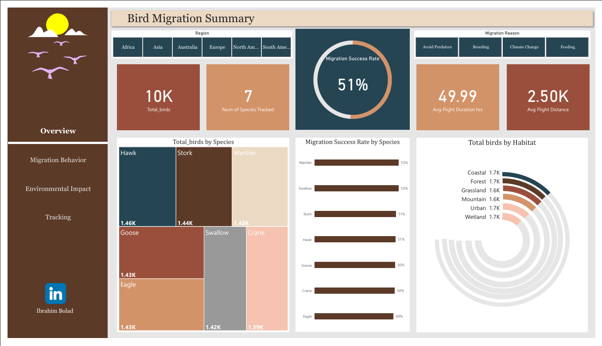
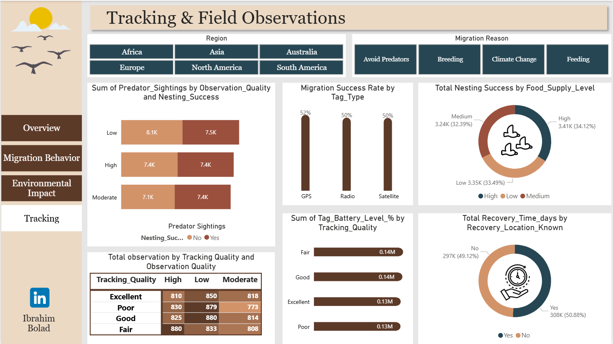

# Bird Migration Analysis Dashboard


## 🦅 Interactive Wildlife Tracking & Environmental Impact Analysis

A comprehensive Power BI dashboard analyzing migration patterns of 10,000 tracked birds across 7 species, exploring the relationships between environmental conditions, habitat types, and migration success rates to support conservation efforts and ecological research.

---

## 🎯 Business Problem

**Challenge:** Wildlife researchers and conservation organizations need to understand:
- Which environmental factors most impact successful bird migration?
- How do different habitats affect migration outcomes?
- What weather conditions optimize migration success?
- When and where should conservation efforts be prioritized?

**Solution:** Built an interactive analytical dashboard that transforms raw GPS tracking data into actionable ecological insights for researchers, conservationists, and policymakers.

---

## 📊 Key Findings & Metrics

### **Overall Migration Performance**
```
📍 Total Birds Tracked: 10,000
🐦 Species Analyzed: 7 (Hawk, Stork, Warbler, Goose, Eagle, Swallow, Crane)
✅ Migration Success Rate: 51%
✈️ Average Flight Distance: 2,504 km
⏱️ Average Flight Duration: 50 hours
```

### **Species-Level Success Rates**
| Species | Birds Tracked | Success Rate |
|---------|--------------|--------------|
| **Warbler** | 1,429 | 53% |
| **Swallow** | 1,423 | 53% |
| **Hawk** | 1,464 | 51% |
| **Stork** | 1,439 | 51% |
| **Goose** | 1,428 | 50% |
| **Crane** | 1,391 | 50% |
| **Eagle** | 1,426 | 49% |

**Key Insight:** Smaller, more agile species (Warbler, Swallow) show slightly higher success rates compared to larger birds.

---

## 🌍 Environmental Impact Analysis

### **Weather Conditions & Success**
```
☀️ Clear Weather: 53% success (highest)
🌧️ Rainy Conditions: 51% success
💨 Windy Conditions: 51% success
🌫️ Foggy Conditions: 50% success
⛈️ Stormy Weather: 50% success (lowest)
```

**Finding:** Clear weather provides optimal migration conditions, while storms create the most challenging environment.

### **Habitat Performance**
```
🏞️ Wetland: 52% success (best habitat)
🏖️ Coastal: 52% success
🌾 Grassland: 52% success
🏙️ Urban: 51% success
🌲 Forest: 51% success
⛰️ Mountain: 48% success (most challenging)
```

**Conservation Priority:** Mountain habitats show lowest success rates - potential intervention area.

---

## 🔍 Migration Behavior Insights

### **Flock Migration Impact**
- **Migrated in Flock:** 50.23% success rate
- **Solo Migration:** 49.77% success rate
- **Analysis:** Minimal difference suggests both strategies are viable depending on species behavior.

### **Migration Interruptions**
```
Primary Interruption Causes:
1. Storm Events: 2,065 birds (20.7%)
2. Injury: 2,022 birds (20.2%)
3. Predator Encounters: 1,989 birds (19.9%)
4. Lost Signal: 1,939 birds (19.4%)

Overall Interrupted: 50.31% of migrations
```

**Risk Factor:** Weather-related interruptions are the leading cause - climate change implications.

---

## 📡 Tracking Technology Performance

### **Tag Type Effectiveness**
```
📍 GPS: 52% migration success
📻 Radio: 50% migration success
🛰️ Satellite: 50% migration success
```
*All tracking methods show consistent performance*

### **Tracking Quality Distribution**
- Excellent: 810 observations (High quality data)
- Good: 825 observations
- Fair: 880 observations
- Poor: 830 observations

### **Recovery Metrics**
- **Recovery Location Known:** 50.88% of birds
- **Average Recovery Time:** 297 days (for known locations)

---

## 🛠️ Technical Implementation

### **Data Architecture**
- **Primary Table:** `bird_migration_data` (10,000 records, 40+ attributes)
- **Dimension Table:** `MonthTable` (for temporal analysis)
- **Relationships:** Active/Inactive for start/end month tracking
- **Measures:** 24 DAX calculations for KPIs and analysis

### **Key DAX Calculations**

#### **Migration Success Rate**
```dax
Migration Success Rate = 
VAR Total = COUNTROWS(bird_migration_data)
VAR Successful = 
    CALCULATE(
        COUNTROWS(bird_migration_data),
        bird_migration_data[Migration_Success] = "Successful"
    )
RETURN DIVIDE(Successful, Total)
```

#### **Habitat-Specific Analysis**
```dax
Coastal Birds = 
CALCULATE(
    [Total_birds],
    KEEPFILTERS(bird_migration_data[Habitat] = "Coastal")
)
```

#### **Temporal Analysis with Inactive Relationships**
```dax
Total Birds by End Month = 
CALCULATE(
    [Total_birds],
    USERELATIONSHIP(
        bird_migration_data[Migration_End_Month],
        MonthTable[Month]
    )
)
```

### **Advanced Features**
- ✅ **Multi-dimensional filtering:** Region, Species, Habitat, Weather, Migration Reason
- ✅ **Temporal analysis:** Migration start/end month patterns
- ✅ **Environmental correlation:** Weather, humidity, visibility, wind speed impacts
- ✅ **Tracking quality metrics:** Signal strength, battery level, observation quality
- ✅ **Behavioral insights:** Flock vs. solo, predator encounters, nesting success

---

## 📸 Dashboard Preview

### 1. Bird Migration Summary (Overview)


**Highlights:**
- KPI cards: Total birds, species count, success rate
- Species distribution bar chart
- Habitat performance circular chart
- Success rates by species
- Regional filtering capabilities
- Migration reason segmentation (Avoid Predators, Breeding, Climate Change, Feeding)

---

### 2. Migration Behavior Analysis


**Key Visualizations:**
- Migration interruption analysis (50.31% interrupted)
- Interruption reasons breakdown (Storm, Injury, Predator, Lost Signal)
- Flock migration impact (50.23% success when in flock)
- Temporal patterns: Start month vs. End month comparisons
- Peak migration periods: March (1.30K start), November (1.47K end)

---

### 3. Environmental Conditions & Impact


**Analysis Focus:**
- Wind speed by habitat (average 30-31 kmph across all habitats)
- Weather condition impact on success rates (Clear: 53%, Stormy: 50%)
- Humidity correlation with success (40-60% optimal range)
- Visibility impact analysis (5-20 km range)
- Habitat-specific environmental profiles

---

### 4. Tracking & Field Observations


**Technical Metrics:**
- Predator sightings vs. observation quality matrix
- Nesting success by food supply level (High: 34.12%, Medium: 32.39%, Low: 33.49%)
- Tag battery levels by tracking quality (Excellent: 0.14M, Fair: 0.14M)
- Recovery location knowledge: 50.88% with known locations
- Recovery time distribution (average 297 days)
- Observation counts by tracking & observation quality

---

## 🎓 Skills Demonstrated

### **Data Analysis & Visualization**
- ✅ **Ecological data analysis** (species behavior, environmental factors)
- ✅ **Statistical correlation** (weather conditions vs. success rates)
- ✅ **Temporal pattern recognition** (seasonal migration trends)
- ✅ **Multi-factor analysis** (habitat, weather, tracking quality interactions)

### **Business Intelligence**
- ✅ **Conservation KPI design** (success rates, recovery metrics)
- ✅ **Risk factor identification** (interruption causes, environmental challenges)
- ✅ **Performance benchmarking** (species, habitat, tracking method comparisons)
- ✅ **Stakeholder-focused reporting** (researchers, conservationists, policymakers)

### **Technical Proficiency**
- ✅ **DAX calculations** (success rates, averages, conditional aggregations)
- ✅ **Relationship management** (active/inactive for temporal analysis)
- ✅ **Data modeling** (fact + dimension tables)
- ✅ **Interactive filtering** (slicers, cross-filtering across pages)
- ✅ **Visual design** (color psychology for ecological themes)

### **Domain Knowledge**
- ✅ **Wildlife conservation** (migration patterns, species behavior)
- ✅ **Environmental science** (habitat types, weather impacts)
- ✅ **GPS tracking technology** (tag types, signal quality, battery management)
- ✅ **Ecological research methods** (observation quality, recovery protocols)

---

## 💡 Actionable Insights for Stakeholders

### **For Conservation Organizations:**
1. **Priority Intervention Zones:**
   - Mountain habitats show lowest success (48%) - need habitat improvements
   - Storm-related interruptions (20.7%) - establish emergency shelters along routes
   
2. **Optimal Tracking Investment:**
   - GPS, Radio, and Satellite all perform similarly (~50-52% success)
   - Focus on tracking quality rather than technology type
   
3. **Species-Specific Strategies:**
   - Smaller species (Warbler, Swallow) adapt better - study their techniques
   - Larger species (Eagle, Crane) may need targeted support programs

### **For Wildlife Researchers:**
1. **Data Collection Focus:**
   - 50.88% recovery rate achievable with current methods
   - Improve tracking battery life for longer studies (current average: 0.14M readings)
   
2. **Environmental Correlations:**
   - Clear weather increases success by 6% vs. storms
   - Humidity range 40-60% appears optimal for migration
   
3. **Behavioral Studies:**
   - Flock vs. solo migration shows minimal impact (0.46% difference)
   - Investigate species-specific social structures

### **For Policymakers:**
1. **Climate Change Preparedness:**
   - 20.7% storm interruptions suggest increasing extreme weather vulnerability
   - Establish protected corridors along critical migration paths
   
2. **Habitat Protection:**
   - Wetland, Coastal, and Grassland habitats perform best (52% success)
   - Prioritize conservation of these high-performing habitat types
   
3. **Research Funding:**
   - Average recovery time of 297 days enables long-term studies
   - Invest in sustained tracking programs for multi-year insights

---

## 🚀 Future Enhancements

### **Phase 2: Advanced Analytics**
- [ ] **Machine Learning Integration:** Predict migration success based on weather forecasts
- [ ] **Route Optimization:** Identify safest migration corridors using historical data
- [ ] **Climate Impact Modeling:** Project future success rates under climate scenarios
- [ ] **Species Comparison Tool:** Interactive species-to-species behavioral analysis

### **Phase 3: Real-Time Capabilities**
- [ ] **Live Tracking Dashboard:** Integrate with active GPS tags for real-time monitoring
- [ ] **Automated Alerts:** Notify researchers of birds in distress or unusual patterns
- [ ] **Weather API Integration:** Dynamic weather condition overlays on migration routes
- [ ] **Crowdsourced Observations:** Mobile app for citizen scientist contributions

### **Phase 4: Expanded Scope**
- [ ] **Multi-Year Trends:** Analyze changes in migration patterns over time
- [ ] **Global Migration Patterns:** Expand beyond current 6 regions
- [ ] **Species Interaction Analysis:** Study inter-species migration dynamics
- [ ] **Genetic Diversity Tracking:** Integrate DNA data for population health insights

---

## 📞 Contact & Collaboration

**Ibrahim Bolad**  
*Data Analyst | Analytics Engineer | Wildlife Data Specialist*

📧 **Email:** bolad68@gmail.com  
💼 **LinkedIn:** [Ibrahim Bolad](https://linkedin.com/in/ibrahimbolad)  
🌐 **Location:** Riyadh, Saudi Arabia

**Open to:**
- Conservation analytics projects
- Ecological data analysis collaborations
- Wildlife research data partnerships
- Speaking engagements on environmental data science

---

## 🏅 Certifications

- ✅ **Microsoft Certified: Fabric Analytics Engineer Associate (DP-600)**
- ✅ **Microsoft Certified: Power BI Data Analyst Associate (PL-300)**
- ✅ **Google Data Analytics Professional Certificate**
- ✅ **DataCamp SQL Associate**

---

## 📂 Project Files

### **Repository Contents:**
- `Birds_Migration.pbix` - Power BI Desktop file (full data model & analysis)
- `README.md` - This comprehensive documentation
- `Screenshot_2026-02-20_232012.png` - Overview dashboard
- `Screenshot_2026-02-20_232042.png` - Migration behavior analysis
- `Screenshot_2026-02-20_232100.png` - Environmental impact page
- `Screenshot_2026-02-20_232116.png` - Tracking & observations page

---

## 📜 Data Attribution

**Dataset Type:** Synthetic wildlife tracking data (for educational/portfolio purposes)  
**Dashboard & Analysis:** Original work by Ibrahim Bolad (2026)  
**License:** MIT License (free to use with attribution)

**Note:** While this dataset is synthetic, the analytical methods and insights demonstrated are directly applicable to real-world conservation research and wildlife tracking projects.

---

## ⭐ Support This Project

If you found this analysis valuable:
- ⭐ **Star this repository** to bookmark
- 🔄 **Share with wildlife researchers** and conservation organizations
- 💬 **Open an issue** for questions or suggestions
- 🤝 **Connect on LinkedIn** for collaboration on real-world conservation projects

---

## 🌍 Impact & Applications

This dashboard methodology can be applied to:
- **Sea Turtle Migration:** Ocean current impacts on nesting success
- **Monarch Butterfly Tracking:** Pollinator conservation strategies
- **Caribou/Elk Movement:** Large mammal habitat preservation
- **Salmon Spawning Analysis:** Aquatic ecosystem health monitoring
- **Bat Migration Studies:** Disease vector tracking and cave protection

---

## 🙏 Acknowledgments

Special thanks to:
- **Wildlife conservation community** for inspiring data-driven approaches to protecting biodiversity
- **Power BI community** for technical guidance on ecological data visualization
- **Research biologists** whose tracking methodologies informed this analysis

---

**Built with 🦅 for wildlife conservation and ecological research**

*Supporting data-driven decisions to protect our planet's biodiversity*

---

*Last Updated: February 2026*  
*Version: 1.0*  
*Status: Production Ready*
